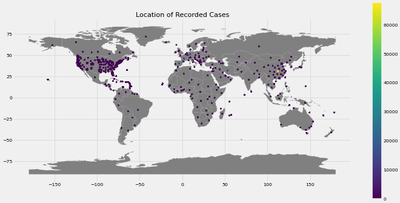

# nCoV-19 

**Data Source:** [Humanitarian Data Exchange - HDX](https://data.humdata.org/dataset/novel-coronavirus-2019-ncov-cases)

**Introduction:** A look at 

- What measures are being taken across the globe and when. Tracking the progression over time.
- Where are the cases 
- What's next 

**Methodology:** Descriptive and exploratory analysis 

### Summary

- [Measures Notebook](https://nbviewer.jupyter.org/github/bilha-analytics/DataSaysWhat/blob/545efccb2cfcd382197c2c7323383a61bbf53f1f/ncov19/quick_view_covid-19.ipynb) 

- [Cases Notebook](https://nbviewer.jupyter.org/github/bilha-analytics/DataSaysWhat/blob/fb748cda60ae52e805d66206a7d9a9de66c37fe8/ncov19/cases_over_time.ipynb)

